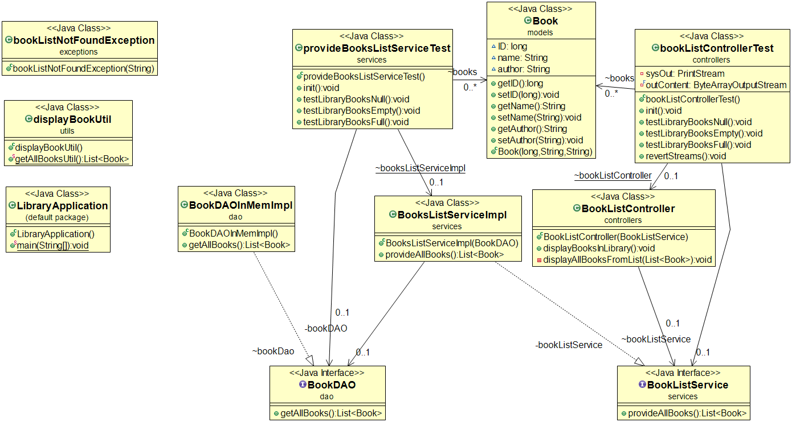

# Library Management System
## To run this project-
1. Install JDK for Java (any version 1.8 onwards)
2. Set JAVA Environment
3. Install Maven
4. Set Maven Environment

## Running Unit Tests With Maven

You can run your unit tests by running the following command at the command prompt:

    mvn clean test   

To run all tests

    mvn clean -Dtest="*" test

To only compile the project

    mvn clean compile


## Story 1-
```
User can view books in library
Scenario : As a User
I want to see the books present in the library
So that I can chose which book to borrow
Given , there are no books in the library
When , I view the books in the library
Then , I see an empty library
Given , there are books in the library
When , I view the books in the library
Then , I see the list of books in the library
```

- Assumptions-  
This project can be created using Java and tested using JUnit by adding its dependency using Maven dependency management.
It is assumed that JDK and Maven are available to run the project.
A command line application- class library is created instead of a web application based on the story provided.

- Class modeling-
The client will interact with the controller class and it will return the required information to the specific client (Here, the client is assumed only using the console to interact with this backend, so output is shown on console with this implementation of controller. If the output is to be provided to some other client, another controller specific to the other client can be created and used).
The service class will use the data from the repository to build the business logic and provide information to the controller implementation. This is independent of the client.
A repository will return the data as a list as required by any service/controller.
A DAO interface is created and can be implemented to cater to any kind of file/inmemory/relational or non relational database configuration to be used later. For now only one implementation is created which would create some sample objects in memory for the tests to run and pass. No setup needs to be done for these tests.
The model class objects (entities and enums of the system) are used by the DAO and repository classes.
Any user defined exceptions are created as custom exception classes to give specific messages.
A bookDAO interface is implemented by bookDAOInmemImpl to return some books created inmemory for now. This is returned as a list from bookRepository from that specific DAOImpl (only inmemory for now).
A book model class object is used in these classes. (Book detail fields for the model- ID, Name and Author are assumed)
The bookListService class checks if the list is empty or not, and returns the specific information to the controller. If the booklist is null, it throws a bookListNotFoundException.
The bookListController displays message to the console "The library is empty" if service class returns an empty library. Otherwise it prints line by line on the console the book details.
The Test classes are arranged in the same manner. The dependencies are mocked using mockito.
All functionalities are tested with 90% coverage.

- DataStructure- A LinkedList is used in DAO as for this story, we only need to traverse entire list to display and no other functionality is expected.

- Principles-
Dependency inversion used so that controller can work with any service implementation based on the type of business rules to be used
Dependency inversion used so that service can work with any DAO implementation based on the persistence media used
A util class is used for tests to avoid repetition (DRY)

The class diagram for this story is-
