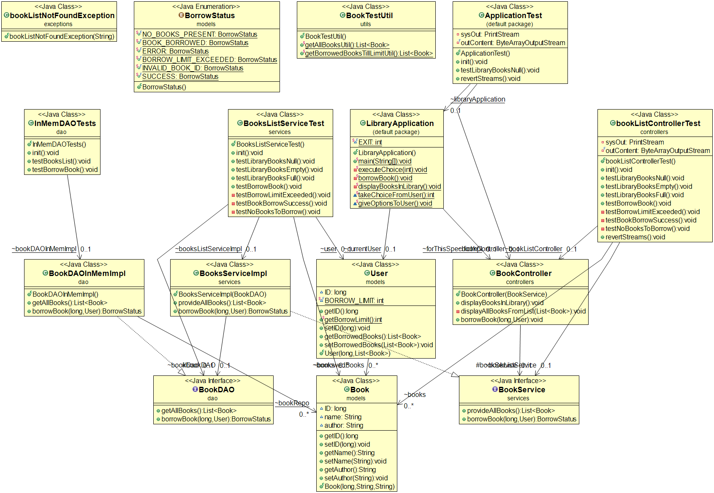
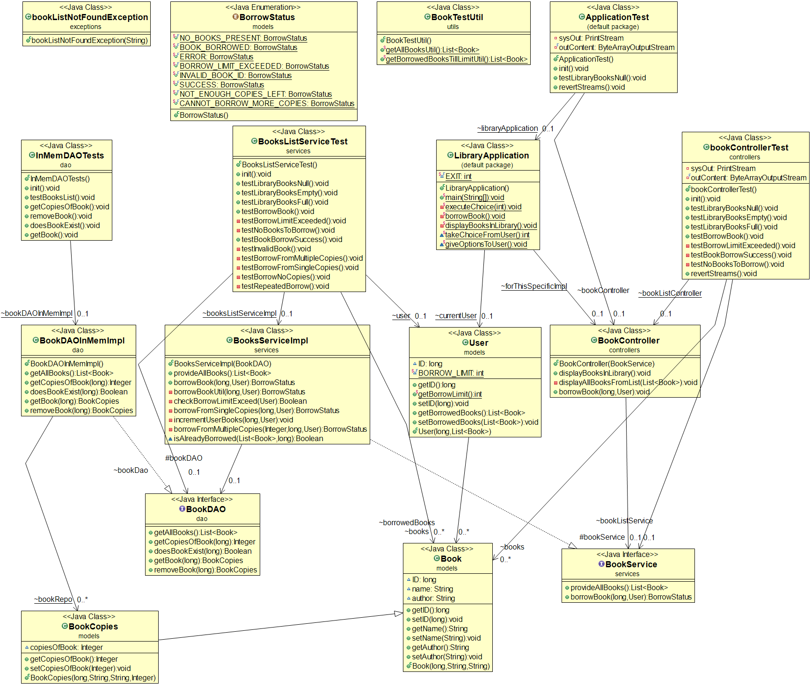
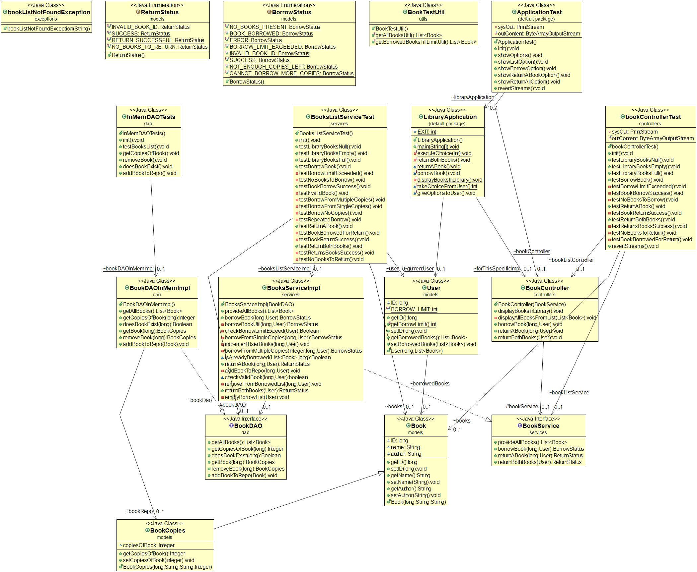

# Library Management System
## To run this project-
1. Install JDK for Java (any version 1.8 onwards)
2. Set JAVA Environment
3. Install Maven
4. Set Maven Environment

## Running Unit Tests With Maven

To run unit tests/compile/install please run the following command at the command prompt:

    mvn clean test   
    mvn clean compile
    mvn clean install

To run the project over the command line, in the directory of the project, execute the command-
    
    java -jar runnablejar.jar

## Story 1-
```
User can view books in library
Scenario : As a User
I want to see the books present in the library
So that I can chose which book to borrow
Given , there are no books in the library
When , I view the books in the library
Then , I see an empty library
Given , there are books in the library
When , I view the books in the library
Then , I see the list of books in the library
```

- Assumptions-  
This project can be created using Java and tested using JUnit by adding its dependency using Maven dependency management.
It is assumed that JDK and Maven are available to run the project.
A command line application- class library is created instead of a web application based on the story provided.

- Class modeling-
The client will interact with the controller class and it will return the required information to the specific client (Here, the client is assumed only using the console to interact with this backend, so output is shown on console with this implementation of controller. If the output is to be provided to some other client, another controller specific to the other client can be created and used).
The service class will use the data from the repository to build the business logic and provide information to the controller implementation. This is independent of the client.
A repository will return the data as a list as required by any service/controller.
A DAO interface is created and can be implemented to cater to any kind of file/inmemory/relational or non relational database configuration to be used later. For now only one implementation is created which would create some sample objects in memory for the tests to run and pass. No setup needs to be done for these tests.
The model class objects (entities and enums of the system) are used by the DAO and repository classes.
Any user defined exceptions are created as custom exception classes to give specific messages.
A bookDAO interface is implemented by bookDAOInmemImpl to return some books created inmemory for now. This is returned as a list from bookRepository from that specific DAOImpl (only inmemory for now).
A book model class object is used in these classes. (Book detail fields for the model- ID, Name and Author are assumed)
The bookListService class checks if the list is empty or not, and returns the specific information to the controller. If the booklist is null, it throws a bookListNotFoundException.
The bookListController displays message to the console "The library is empty" if service class returns an empty library. Otherwise it prints line by line on the console the book details.
Method namings are used based on the concept of the class it belongs, e.g DAO will "get" from datasource, Service will "provide", and controller will "display"
The Test classes are arranged in the same manner. The dependencies are mocked using mockito.
All functionalities are tested with 90% coverage.

- DataStructure- A LinkedList is used in DAO as for this story, we only need to traverse entire list to display and no other functionality is expected.

- Principles-
Dependency inversion used so that controller can work with any service implementation based on the type of business rules to be used
Dependency inversion used so that service can work with any DAO implementation based on the persistence media used
A util class is used for tests to avoid repetition (DRY)

The class diagram for this story is-


## Story 2-
```
User can borrow a book from the library
Given , there are books in the library
When , I choose a book to add to my borrowed list
Then , the book is added to my borrowed list
And , the book is removed from the library
Note:
a. Each User has a borrowing limit of 2 books at any point of time
```
- Design considerations- 
A repository of current Library books is created in the Book DAO.
As the user can borrow books, a User model class is created which would have an ID, and a list of borrowed books. 
The user can only borrow if library is not empty, hence a new controller method is created for the borrow functionality

- DataStructure:
The DAO Datastructure of bookRepo is added to facilitate the new functionality of searching through the books list to borrow. Hence an efficient HashMap is used instead of a LinkedList, which is set as soon as books are read, to make borrows efficient.
An enum borrowStatus model is created to track the various cases while borrowing the book by the user.

- Principles-
Some names of classes change to generalise them and not introduce unnecessary extra extended classes.
Some refactoring done to avoid repetition in code (DRY)
As options for the user are increasing, the Exit option is made final as choice 20, so that the number is not used in code instead the variable name is used to make the code readable.

The class diagram for this story is-


## Story 3-
```
User can borrow a copy of a book from the library
Given , there are more than one copy of a book in the library
When , I choose a book to add to my borrowed list
Then , one copy of the book is added to my borrowed list
And , the library has at least one copy of the book left
Given , there is only one copy of a book in the library
When , I choose a book to add to my borrowed list
Then , one copy of the book is added to my borrowed list
And , the book is removed from the library
Note:
a. Only 1 copy of a book can be borrowed by a User at any point of time
```
- Assumption-
It is assumed that the information of number of copies available of each book is supposed to be only with the library and should not be displayed to the user. The user will get the relevant message of "Not Enough Copies" if all copies are borrowed of the book.

- Principles-
For this story, we need to add number of copies for each book. Instead of modifying the earlier Book model, we can extend it with a new Model class extending the Book class, to add copies of that book, while giving a new constructor to create books with number of copies. (Open for extension, closed for modification)
All the remaining code need not be changed as the child object can be assigned to the parent object (Liskov Substitution)
With this, the repository of BookDAO changed to have a map of bookcopies now.

- Refactoring-
Removed all business logic from DAO to Service Layer
Made some readability improvements

The class diagram for this story is-


## Story 4-
```
User can return books to the library
Given , I have 2 books in my borrowed list
When , I return one book to the library
Then , the book is removed from my borrowed list
And , the library reflects the updated stock of the book
Given , I have 2 books in my borrowed list
When , I return both books to the library
Then , my borrowed list is empty
And , the library reflects the updated stock of the books
```

Refactored small parts of code

- Principles-
Overall, for all the stories Java Class Structure is created in such a way that levels of abstraction are achieved with the layers. This makes it more maintainable. Having interfaces like Service, DAO and their implementations- ServiceImpl, DAOImpl differently helps us to program to an interface instead of implementation so that we may be able to extend instead of modify; or use another implementation for the interfaces without changing anything where those interfaces are used (for dependency inversion). This gives flexibility and maintainability.

The class diagram for this story is-
